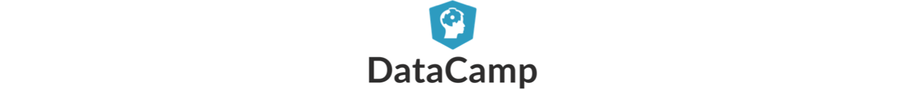

Para las personas interesadas en aprender R hemos creado varios cursos gratuitos que están alojados en la plataforma DataCamp. Para realizar cualquiera de los cursos se deben seguir los siguientes pasos:

1. Ingresar a https://www.datacamp.com y crear una cuenta, es gratis.
2. Dar clic sobre alguno de los siguientes cursos:
    + [Objetos en R](https://www.datacamp.com/courses/objetos-en-R)
    + Regresión lineal en R (__coming soon__).
    + Creación de funciones en R (__coming soon__).
3. Dar clic en el botón "Start Course for Free".
4. Aprender mucho.

