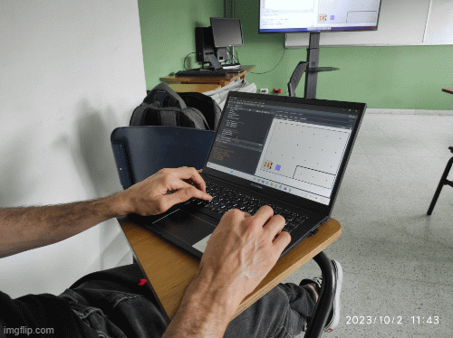

```{r fig.asp=0.6, fig.align='center', echo=FALSE, eval=FALSE}
library(png)
library(grid)
img <- readPNG("imagenes/srunal3.png")
grid.raster(img)
```

<center>

</center>

## ¿Qué es un semillero de investigación?

Son grupos donde se adquieren instrumentos para el desarrollo de investigaciones en un ambiente de tertulia y diálogo, y en donde se aprende a aprender y se descubre nuevo conocimiento y métodos de aprendizaje.

## ¿De dónde vienen los semilleros de investigación?

En el siguiente video se muestra el origen de los semilleros.

<center>
<iframe width="392" height="220" src="https://www.youtube.com/embed/S6nL4hCm54c" title="YouTube video player" frameborder="0" allow="accelerometer; autoplay; clipboard-write; encrypted-media; gyroscope; picture-in-picture" allowfullscreen></iframe>
</center>

## ¿Quiénes pueden participar?

Cualquier estudiante que pase la prueba de admisión.

## Objetivos:

1. Fomentar un espacio de discusión que genere una actitud reflexiva y crítica sobre problemas relacionados con estadística computacional.

2. Proponer y ejecutar proyectos de investigación para las convocatorias del Programa Nacional de Semilleros de Investigación de la Universidad Nacional de Colombia.

## ¿Qué se hace en el Semillero de R?

1. Reuniones regulares.
2. Grupos de estudio.
3. Proponer y ejecutar proyectos de investigación.
4. Divulgación de resultados.
5. Interacción académica

## Dirección del Semillero

- [Freddy Hernández](https://fhernanb.github.io), profesor, Departamento de Estadística, UNAL.


## Contacto

Si usted tiene alguna pregunta o solicitud puede escribir al correo fhernanb@unal.edu.co