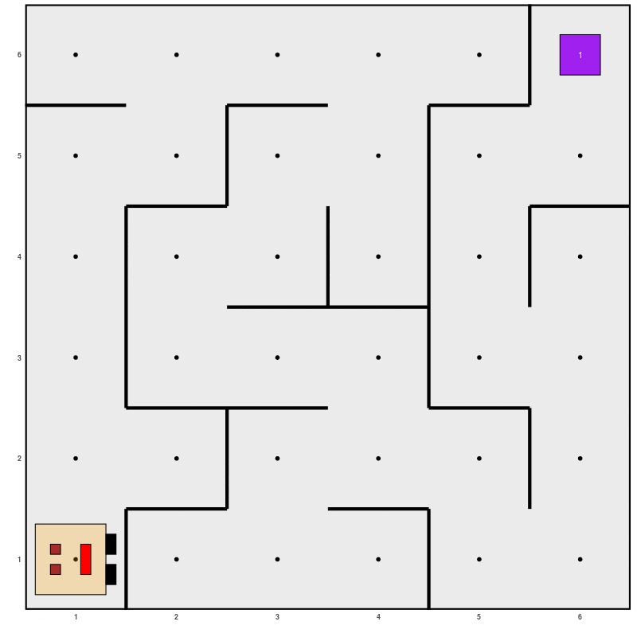

## Introducción

Karel es un robot que nos ayuda a aprender a programa jugando a realizar tareas con el robot karel. Abajo está el hexalogo que identifica al paquete karel y dentro del hexalogo está el robot karel.

```{r karelhexsticker, echo=FALSE, fig.cap='Hexalogo del paquete karel.', dpi=400, fig.align='center', out.width = '15%'}
knitr::include_graphics("imagenes/karel_hexsticker.png")
```

En la siguiente figura se observa una animación de una de las tareas que se pueden hacer con karel. En esta animación se observa cómo el robot recorre el laberinto de forma autónoma hasta encontrar un "coso".

```{r karegif01, echo=FALSE, fig.cap='Ilustración de una tarea con karel.', dpi=400, fig.align='center', out.width = '35%'}

```

Para instalar el paquete karel debes escribir la siguiente instrucción en la consola y esperar a que R cargue ese paquete y otros paquetes auxiliares.

```{r eval=FALSE}
install.packages("karel")
```

Recuerda que se instala una única vez el paquete, no es necesario volver a instarlarlo si ya lo has hecho.

El siguiente paso es cargar el paquete así:

```{r}
library(karel)
```

## Mundos
Karel cuenta con varios mundos, la forma para cargar uno de esos mundos es con la función `generar_mundo()`. El siguiente código genera el mundo 001 que se utiliza como mundo base para aprender a usar a karel.

```{r eval=FALSE}
generar_mundo("mundo001")
```

```{r karelmundo01, echo=FALSE, fig.cap='Mundo 001.', dpi=400, fig.align='center', out.width = '50%'}
knitr::include_graphics("imagenes/karel_mundo_01.png")
```

Llamamos calle a cada fila del mundo rectangular, es decir, las calles corren horizontalmente.

Las avenidas corren verticalmente (son las columnas). La intersección entre una calle y una avenida es llamada celda y se puede identificar por los números fuera del recuadro.

## Tareas básicas

Las tareas básicas que puede realizar el robot son:

- `avanzar()`.
- `girar_izquierda()`.
- `juntar_coso()`.
- `poner_coso()`.

Existe una función auxiliar que se usa para ejecutar las tareas del robot, esa función es `ejecutar_acciones()`. Si no se corre esa función al final de un conjunto de instrucciones, el robot no hará nada.

## Tarea 01

Crear el mundo 001 y hacer que el robot avance dos celdas hacia la derecha, es decir, que termine en calle 1 y avenida 3.

__Solución__

Para hacer lo que se pide en este ejercicio se puede usar el siguiente código.

```{r eval=FALSE}
generar_mundo("mundo001")
avanzar()
avanzar()
ejecutar_acciones()
```

Y el resultado será el siguiente.

```{r kareltarea01, echo=FALSE, fig.cap='Resultado tarea 01.', dpi=400, fig.align='center', out.width = '50%'}
knitr::include_graphics("imagenes/karel_tarea_01.gif")
```

## Tarea 02

Crear el mundo 001 y hacer que el robot avance una celda hacia la derecha, tome el coso y que avance nuevamente a la derecha, es decir, que termine en calle 1 y avenida 3.

__Solución__

Para hacer lo que se pide en este ejercicio se puede usar el siguiente código.

```{r eval=FALSE}
generar_mundo("mundo001")
avanzar()
juntar_coso()
avanzar()
ejecutar_acciones()
```

Y el resultado será el siguiente.

```{r kareltarea02, echo=FALSE, fig.cap='Resultado tarea 02.', dpi=400, fig.align='center', out.width = '50%'}
knitr::include_graphics("imagenes/karel_tarea_02.gif")
```

## Tarea 03

Su misión consiste en escribir el código para crear el mundo 001 y hacer que el robot avance a calle 4 avenida 2.

El resultado deberá ser el siguiente.

```{r kareltarea03, echo=FALSE, fig.cap='Resultado tarea 03.', dpi=400, fig.align='center', out.width = '50%'}
knitr::include_graphics("imagenes/karel_tarea_03.gif")
```

## Tarea 04

Su misión consiste en crear una función que se llame `girar_derecha()`. Use el esquema de abajo para crear su función.

```{r eval=FALSE}
girar_derecha <- function() {
  # escriba aqui sus instrucciones
  # escriba aqui sus instrucciones
  # escriba aqui sus instrucciones
}
```

```{r echo=FALSE}
girar_derecha <- function() {
  girar_izquierda()
  girar_izquierda()
  girar_izquierda()
}
```

Ponga a prueba su función. Construya el mundo 001 y haga que el robot gire a la izquierda una vez, avance dos celdas, luego que gire a la derecha y avance una celda. Eso significa que el robot debe quedar en la calle 3 avenida 2.

El resultado deberá ser el siguiente.

```{r kareltarea04, echo=FALSE, fig.cap='Resultado tarea 04.', dpi=400, fig.align='center', out.width = '50%'}
knitr::include_graphics("imagenes/karel_tarea_04.gif")
```

## Tarea 05

Su misión consiste en crear un código que replique le movimiento del robót tal y como se muestra en la figura siguiente. El robot debe quedar mirando a la derecha cuando llegue a la calle 4 avenida 3.

```{r kareltarea05, echo=FALSE, fig.cap='Resultado tarea 05.', dpi=400, fig.align='center', out.width = '50%'}
knitr::include_graphics("imagenes/karel_tarea_05.gif")
```

```{r eval=FALSE, echo=FALSE}
generar_mundo("mundo001")
girar_izquierda()
avanzar()
girar_derecha()
avanzar()
girar_izquierda()
avanzar()
girar_derecha()
avanzar()
girar_izquierda()
avanzar()
girar_derecha()
ejecutar_acciones()
```


